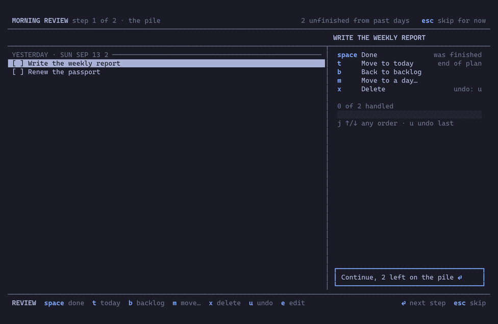

# jobsdone

A keyboard-first daily task manager for the terminal, built around a
daily work routine: plan today, work through it, review what yesterday
left behind. It lives in a floating terminal that a keybind opens for a
moment and closes again, next to btop and lazygit.

Omarchy is the first-class home: the install wires up the window rule,
the keybind and a launcher entry, and the app takes its colours from
whatever theme the terminal is in, dark or light. Any other Linux gets
the binary and a launcher entry, and does its own windowing.

## Install

You need Rust. On Arch that is `sudo pacman -S rustup && rustup default
stable`; elsewhere, https://rustup.rs. Then:

    git clone https://github.com/mikkelon/jobsdone
    cd jobsdone
    make install

This puts the binary in `~/.local/bin`, a `Jobsdone` entry in the app
launcher, and on Omarchy a Hyprland rule that floats and centres the
window at 120 by 36 cells. If SUPER+SHIFT+J is free it offers to bind it
to the app; if the key is taken it says by what and leaves it to you.
Running `make install` again updates everything in place, and `make
uninstall` removes it all except your data.

For other keys or another window, run the script itself:

    scripts/install --keybind "SUPER + ALT + J" --size 1000x700
    scripts/install --no-keybind --tiled

The window flags are settings the app keeps, so a later install leaves
them alone, the settings page changes them without an install, and
`jobsdone desktop [--floating | --tiled] [--size WxH]` writes the
Hyprland rule again from a terminal.

On a Linux desktop that is not Omarchy the launcher entry opens the app
in the default terminal. For a floating window, add a rule for the
terminal window in your compositor's configuration; the app never sizes
or positions itself.

## Use

Press `?` inside the app for every key that works where you are. The
hint bar at the bottom always names the ones that matter most.

In any text field, `Ctrl+Left` and `Ctrl+Right` move by word. This includes
task titles, notes, dates, search, and settings fields.

On the notes page (`n`), `y` copies the selected note; `Alt+y` copies it
from either the list or the editor. Copying preserves the entire text and
leaves the editor in place. This uses `wl-copy` (the `wl-clipboard` package)
on Wayland, or `xclip` on X11.

Notes mark possible US English spelling mistakes using Harper, entirely
offline, with red squiggly underlines (straight underlines on terminals without
styled underline support). Spell checking is off by default; enable
**Spell-check notes in US English** in settings (`,`). The word at the caret
stays unmarked while editing. To correct a word, move the caret into it and press `Alt+s`; use
the arrow keys to choose a suggestion, `Enter` to replace, or `Escape` to
cancel. Checking never changes your text automatically, and notes can still
be written in any language.

To accept a product name or another personal word, open `Alt+s`, press `↑`
to wrap to **Add to dictionary**, then `Enter`. Manage saved words under
**Settings → Notes → Personal dictionary**: add, edit, or remove entries.
Personal words ignore capitalization; the list preserves the spelling you enter.

`,` opens the settings page: the hour the day starts, which days are work
days, how far back the review pile reaches, whether the window floats and
how big it is, and a few more. Each row says what it does and what it
holds when nobody has changed it.

`docs/PRODUCT.md` says what the program does and why, `docs/DESIGN.md`
how it looks and behaves, and `wireframes/index.html` shows every screen.

## Command line and agents

Subcommands use the same database as the terminal app and exit after completing
an operation. `jobsdone --help` lists them; add `--json` for structured output.

    jobsdone task list --day today --json
    jobsdone task add "Prepare demo" --day today --focus
    jobsdone task move 42 17 --day today
    jobsdone task reorder 42 --before 17

Commands support complete changes in one invocation, including multiple task IDs
and properties, with atomic saving and one undo entry. Reads leave recurrence and
the morning review gate alone; `jobsdone refresh` catches up recurring copies.
[The CLI guide](docs/CLI.md) explains JSON input, dates, ordering, undo, and errors.

Every release embeds an agent skill: `jobsdone --skill` prints the version that
matches the binary, without opening the database. Agents discover it through
`--help`. Skill installation into an agent's project or personal directory is an
explicit export; installation never automatically copies or symlinks it there.

## Files

The database is at `~/.local/share/jobsdone/jobsdone.db` and is the
only thing worth backing up: the settings are in it too. The log is at
`~/.local/state/jobsdone/jobsdone.log`. There is no configuration file.

## Development

`make check` runs what CI runs: format check, clippy, tests. `make run`
starts the app against a scratch database in `.dev`, never the real
one. `uat/` holds the tools for driving the built program and for trying
the install on a clean Omarchy machine in a VM; `uat/README.md` explains
them.

## License

MIT, see `LICENSE`.
